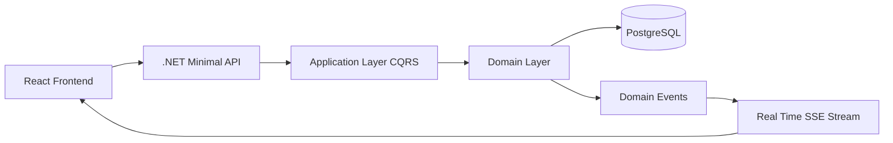
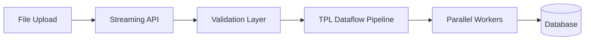

<h1 align="center">
  Hi 👋, I'm Stéphane G. Adjakotan
</h1>

<h3 align="center">
Senior Full Stack Developer (.NET • React • Distributed Systems)
</h3>

<p align="center">
  
</p>

<p align="center">
  📍 Île-de-France, France  
  <br>
  💼 <a href="https://linkedin.com/in/stephane-g-adjakotan">LinkedIn</a>  
  💻 <a href="https://github.com/Stephane-AmStrong">GitHub</a>  
</p>

---

# 🚀 About Me

Senior **Full Stack Developer (.NET / React)** with **12+ years of experience building high-performance enterprise platforms**.

I specialize in:

- High performance backend systems
- Clean Architecture / CQRS
- Parallel & asynchronous processing
- Real-time event-driven architectures
- Scalable distributed systems

Industries:

- Energy trading
- FinTech platforms
- Advertising tech
- Healthcare systems
- Education platforms

---

# 🧠 Architecture Expertise

```text
Microservices
Event Driven Architecture
CQRS
Clean Architecture
Onion Architecture
High Throughput Processing
Parallel Programming
Real-Time Systems
````

---

# 🏗 Example Architecture



Example architecture used in **ENGIE monitoring platform**.

---

# ⚡ High Throughput Processing Pipeline



Architecture used for **financial invoice processing at Pluxee**.

---

# 🛠 Tech Stack

### Backend


### Frontend


### Databases


### DevOps


---

# 💼 Professional Experience

## ENGIE — Energy Trading Monitoring Platform

Full redesign of a **100+ servers monitoring system**.

Key achievements:

* .NET 9 Minimal API backend
* CQRS architecture
* Real-time updates using SSE
* 53–68% performance improvement
* React feature-based architecture

---

## Pluxee — Financial Microservices Platform

Migration of billing system **monolith → microservices**.

Highlights:

* TPL Dataflow pipelines
* Streaming file ingestion
* Parallel invoice processing
* React automation tools

---

## TF1 — Advertising Campaign Platform

Development of **Digital Beta module** inside TF1 App Labox.

Highlights:

* Angular frontend
* Parallel backend execution
* Azure DevOps CI/CD

---

## H24 Consulting

Development of **GesMed Medical Imaging Platform**:

* Patient management
* Appointment scheduling
* Medical reporting
* Billing workflows

Architecture:

* CQRS
* Onion architecture
* Dockerized CI/CD

---

## Simple IT — Education Platform

Development of **Orageu-AUN**, connecting African and international universities.

Key features:

* Multi-tenant architecture
* Academic program management
* React portal for students

---

## Ministry of Infrastructure — Benin

Development of **construction project monitoring software**.

Technologies:

* .NET WinForms
* SQL Server
* UML modeling

---

## 📊 GitHub Stats


  

---

# 🤝 Connect With Me

LinkedIn
[https://linkedin.com/in/stephane-g-adjakotan](https://linkedin.com/in/stephane-g-adjakotan)

GitHub
[https://github.com/Stephane-AmStrong](https://github.com/Stephane-AmStrong)
